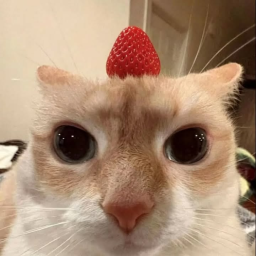
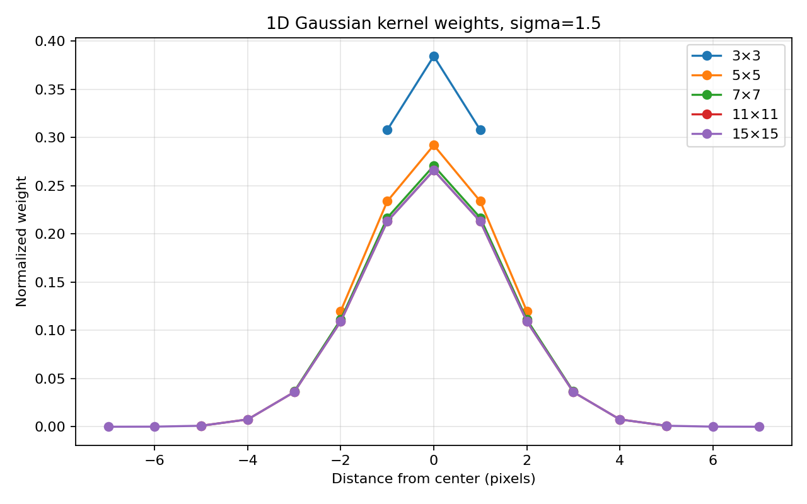
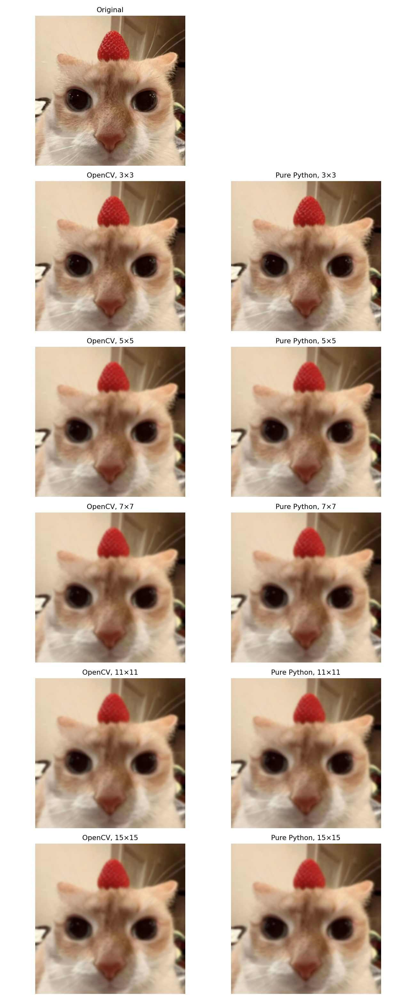
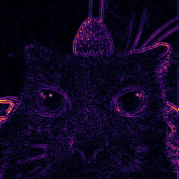
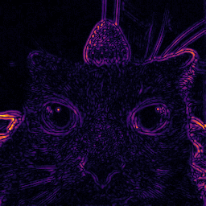
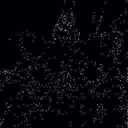
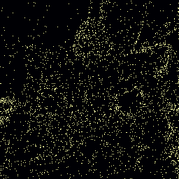
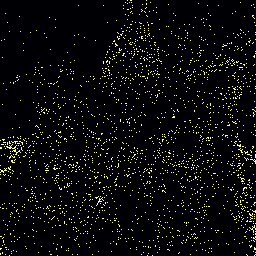
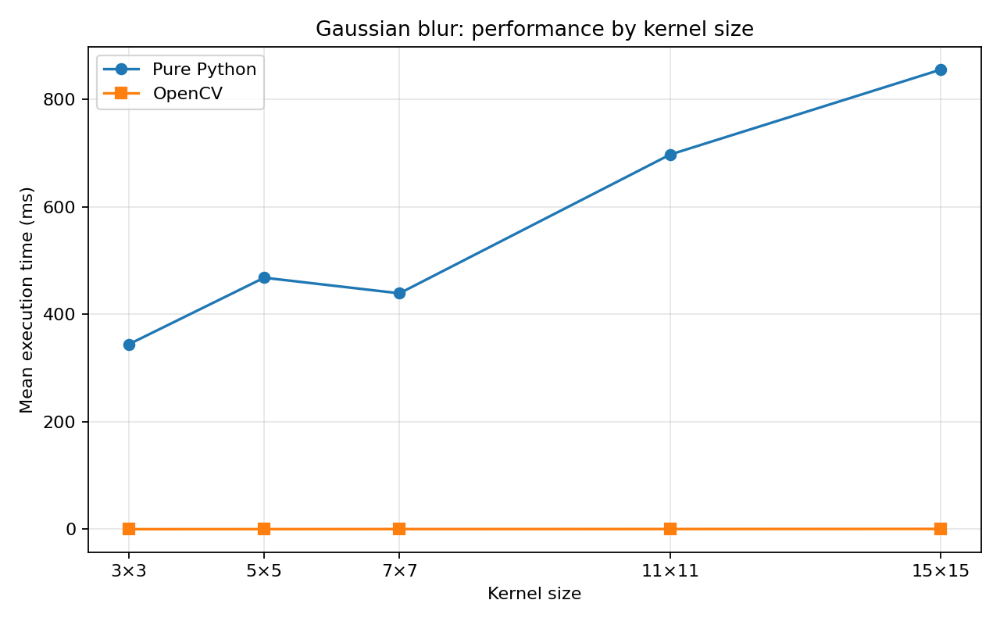

# Лабораторная работа: усредняющий фильтр Гаусса

**Вариант:** усредняющий фильтр Гаусса с переменным размером ядра и параметрами гауссианы.  
**Язык:** Python. **Подход:** функциональный стиль, без классов. **Реализации:** собственная на Python и библиотечная через OpenCV.

## Цель и постановка задачи

Цель работы — реализовать алгоритм сглаживания цифрового изображения гауссовым фильтром, изучить влияние параметров фильтра на результат и сравнить время выполнения двух реализаций.

В ходе работы необходимо:
1. Реализовать фильтр самостоятельно и средствами готовой библиотеки.
2. Обеспечить настройку **размера ядра** и **стандартного отклонения** `sigma`.
3. Сравнить обработанные изображения и скорость работы при нескольких размерах ядра.
4. Представить результаты измерений, изображения, графики и выводы.

## 1. Теоретическая база

### 1.1. Цифровое изображение и сглаживание

Цветное цифровое изображение представляется массивом размером `H × W × 3`, где `H` — высота, `W` — ширина, а три компоненты соответствуют каналам B, G, R в OpenCV. Яркость каждого канала в используемом изображении хранится целым числом от 0 до 255 (`uint8`).

Сглаживающий фильтр заменяет значение текущего пикселя взвешенным средним значений в его окрестности. При этом высокочастотные изменения яркости (мелкие детали и часть шума) ослабляются. В отличие от обычного арифметического усреднения, у фильтра Гаусса ближайшие к центру пиксели получают **больший вес**, чем более удалённые.

### 1.2. Формула Гаусса и ядро свёртки

Двумерная функция Гаусса с одинаковым стандартным отклонением по обеим осям:

$$
G(x,y)=\frac{1}{2\pi\sigma^2}\exp\left(-\frac{x^2+y^2}{2\sigma^2}\right).
$$

Здесь `x`, `y` — смещения относительно центрального пикселя, `σ > 0` — стандартное отклонение. Коэффициенты берут на дискретной сетке вокруг центра и **нормируют**, чтобы их сумма была равна единице:

$$
K_{i,j}=\frac{G(i,j)}{\sum_{p,q}G(p,q)}, \qquad \sum_{i,j}K_{i,j}=1.
$$

Нормировка нужна, чтобы участок с постоянной яркостью оставался таким же после фильтрации. Новое значение канала пикселя вычисляется как сумма произведений значений соседних пикселей на соответствующие веса ядра:

$$
I_{\mathrm{out}}(x,y,c)=\sum_{i=-r}^{r}\sum_{j=-r}^{r} K_{i,j}\,I_{\mathrm{in}}(x-i,y-j,c),
\qquad r=\frac{k-1}{2}.
$$

`k` — нечётный размер ядра: 3, 5, 7, 11, 15 и т. д. Каждый цветовой канал обрабатывается отдельно.

### 1.3. Размер ядра и параметр sigma — не одно и то же

- **Размер ядра `k × k`** задаёт *границы окрестности*, участвующей в вычислениях. Чем больше `k`, тем больше соседей можно учесть и тем больше операций потребуется.
- **`sigma`** задаёт *ширину распределения весов*. При маленькой `sigma` вес концентрируется около центра, при большой — распределяется по более далёким пикселям.
- При фиксированной `sigma` увеличение `k` **не обязано** заметно усиливать размытие: за пределами нескольких `sigma` коэффициенты становятся очень маленькими.

### 1.4. Разделимость ядра

Гауссово ядро разделимо: двумерную гауссиану можно представить произведением горизонтальной и вертикальной одномерных функций:

$$
G(x,y)=g(x)\,g(y), \qquad
 g(t)=\frac{1}{\sqrt{2\pi}\sigma}\exp\left(-\frac{t^2}{2\sigma^2}\right).
$$

В программе сначала применяется одномерная свёртка **по строкам**, затем — **по столбцам**. Промежуточные значения сохраняются как числа с плавающей точкой и округляются только после второго прохода. Вместо порядка сложности `O(H·W·k²)` для прямой двумерной свёртки получается `O(H·W·k)` для двух одномерных проходов. Это оценка количества операций, а не гарантия конкретного ускорения.

### 1.5. Обработка границ

Когда ядро выходит за пределы изображения, используется зеркальное продолжение без повторения крайнего пикселя — `BORDER_REFLECT_101`. Например, для последовательности `a, b, c, d` продолжение слева имеет вид `c, b, a, b, c, d, c, b, ...`. Одинаковый способ обработки краёв выбран в обеих реализациях, чтобы их можно было корректно сравнивать.

## 2. Описание разработанной системы

### Последовательность обработки

1. Загрузить картинку в BGR, при необходимости уменьшить до указанной максимальной стороны.
2. Для каждого ядра из списка вычислить нормированные коэффициенты `g`.
3. На Python выполнить горизонтальную фильтрацию по всем трём каналам, сохранив промежуточный массив.
4. Выполнить вертикальную фильтрацию, округлить и ограничить значения интервалом `[0, 255]`.
5. Независимо получить результат вызовом `cv2.GaussianBlur(image, (k, k), sigmaX=sigma, sigmaY=sigma, borderType=cv2.BORDER_REFLECT_101)`.
6. Для **каждого** ядра сравнить методы по времени и расхождению значений каналов.
7. Дополнительно сравнить **разные ядра**: результат OpenCV при минимальном `k` и результаты при остальных `k`.
8. Сохранить изображения, графики и CSV.

## 3. Результаты работы и тестирования

### 3.1. Условия эксперимента

Вход: цветное изображение кота с клубникой, **256×256 пикселей**, 3 цветовых канала. Использованы ядра **3×3, 5×5, 7×7, 11×11, 15×15**, при **постоянной `sigma = 1.5`**. Это позволяет изучить изменение именно размера ядра, не смешивая его с изменением параметра распределения.

Для сопоставления методов использовались одинаковые изображение, размер ядра, sigma и обработка краёв. Для замера времени каждое сочетание алгоритма и размера ядра выполнялось несколько раз; в таблице ниже приведён **отдельный контрольный запуск на 256×256 с 3 повторами в данной среде исполнения**, а не замеры с компьютера автора или из пользовательского Google Colab. Значения скорости будут отличаться на другой машине.

*Рисунок 1 — исходное изображение до фильтрации. На нём хорошо заметны резкие контуры глаз, носа, ушей, волосков шерсти и семян клубники; они позволяют наблюдать изменение детализации.*

### 3.2. Влияние параметров на коэффициенты ядра

*Рисунок 2 — нормированные одномерные коэффициенты Гаусса для разных размеров ядер при sigma = 1.5.*

Горизонтальная ось показывает расстояние от центра ядра в пикселях, вертикальная — коэффициент (вес) пикселя. Все кривые симметричны, максимальный вес находится в центре. Для ядра 3×3 вес центра значительно больше, поскольку при нормировке используются всего три коэффициента; при расширении ядра добавляются новые ненулевые веса и центр получает относительно меньшую долю. Кривые 11×11 и 15×15 практически совпадают в общей области, поскольку при `sigma = 1.5` веса удалённых пикселей уже близки к нулю. **Это объясняет, почему изображения от 11×11 и 15×15 выглядят практически одинаково.**

### 3.3. Визуальное сравнение фильтрации

*Рисунок 3 — исходник, затем результаты OpenCV (слева) и чистого Python (справа) при одинаковых размерах ядер.*

По изображению можно сделать следующие наблюдения:

- **3×3:** наиболее щадящее сглаживание. Глаза, волоски шерсти и фактура клубники видны отчётливее, чем при остальных ядрах.
- **5×5:** мелкие текстуры ослабляются, переходы между соседними цветами становятся более плавными; контуры всё ещё различимы.
- **7×7:** размытие немного усиливается, тонкие детали шерсти теряются сильнее.
- **11×11:** основные крупные формы сохраняются, мелкие элементы сглажены; по сравнению с 7×7 изменение небольшое.
- **15×15:** на глаз результат почти неотличим от 11×11. Причина — неизменная `sigma = 1.5`: далеко расположенные элементы имеют пренебрежимо малые веса.

**Столбцы OpenCV и Pure Python визуально совпадают** при каждом размере: это ожидаемый результат корректной реализации одного и того же фильтра. Незначительные расхождения в отдельных значениях пикселей объясняются особенностями внутренней арифметики и округления.

### 3.4. Карты различий *между размерами ядер*

| 3×3 против 5×5 | 3×3 против 7×7 |
|:---:|:---:|
|  |  |
| **3×3 против 11×11** | **3×3 против 15×15** |
|  |  |

*Рисунок 4 — контрастные карты различий результата фильтрации ядром 3×3 и результатов с более крупными ядрами. Для этого сравнения в обоих случаях берётся OpenCV, меняется только размер ядра.*

Тёплые яркие участки (жёлтый/оранжевый) означают **относительно большую разницу**, тёмно-фиолетовые — небольшую, чёрные — нулевую или очень маленькую разницу. На картах выделяются **контуры глаз, мордочки, ушей, клубники, шерсти**: именно там соседние пиксели сильнее отличаются, поэтому изменение степени сглаживания заметнее. Фон с почти постоянным цветом остаётся тёмным.

**Важно: карта не показывает качество фильтра, наличие ошибки или реальные цвета изображения.** Для каждой пары программа автоматически растягивает значения разницы к диапазону 0–255, а затем применяет цветовую шкалу `INFERNO`. Из-за отдельного масштабирования карт *одинаковая яркость на двух картах не обязательно означает одинаковую численную разницу*. Оценивать величину расхождения надо по числовым метрикам.

Для данной картинки получены следующие значения абсолютной разницы между результатами OpenCV, с усреднением по всем каналам (шкала 0–255):

| Сравниваемые ядра | Средняя абсолютная разница (MAE) | Максимальная разница |
|---|---:|---:|
| 3×3 и 5×5 | 1.388 | 26 |
| 3×3 и 7×7 | 1.832 | 34 |
| 3×3 и 11×11 | 1.949 | 37 |
| 3×3 и 15×15 | 1.949 | 37 |

Средняя разница увеличивается при расширении ядра, затем выходит на плато: результаты 11×11 и 15×15 почти не различаются. Это ожидаемое следствие ограничения эффективной ширины гауссианы при фиксированной `sigma`.

### 3.5. Карты различий *между реализациями*

| Ядро 3×3 | Ядро 5×5 | Ядро 7×7 |
|:---:|:---:|:---:|
|  |  |  |

*Рисунок 5 — различие OpenCV и нативного Python **при одном и том же размере ядра**.*

Эти изображения нельзя путать с рисунком 4. Здесь **размер ядра не меняется**: сравниваются только два способа реализации. Почти полностью чёрный фон с редкими яркими точками показывает, что большинство значений каналов совпадают, а отдельные пиксели имеют малые расхождения. **Автоматическая нормализация делает даже разницу в 1 единицу заметной как яркую точку** — не следует трактовать яркость как большую ошибку. Такая картина является нормальным результатом при почти одинаковых вычислениях и небольших расхождениях округления.

Чтобы количественно оценивать совпадение, используются:

$$
\operatorname{MAE}=\frac{1}{3WH}\sum_{x,y,c}\left|I_{CV}(x,y,c)-I_{Py}(x,y,c)\right|,
$$

а также `MaxDiff` — наибольшее по модулю отклонение одного значения канала. Для данного контрольного запуска средняя ошибка методов лежала примерно в диапазоне **0.005–0.037** единицы из 255 в зависимости от ядра — изображения практически совпадают.

### 3.6. Сравнение быстродействия

*Рисунок 6 — среднее время работы нативной и библиотечной реализаций в зависимости от размера ядра; контрольный запуск в текущей среде.*

| Ядро | Python, мс | OpenCV, мс | Ускорение OpenCV | MAE между методами |
|---|---:|---:|---:|---:|
| 3×3 | 205.361 | 0.354 | 579.5× | 0.0054 |
| 5×5 | 276.213 | 0.121 | 2283.0× | 0.0169 |
| 7×7 | 300.990 | 0.151 | 1992.4× | 0.0159 |
| 11×11 | 411.870 | 0.097 | 4260.0× | 0.0345 |
| 15×15 | 524.965 | 0.963 | 545.4× | 0.0371 |

**Интерпретация:** время нативного Python в целом увеличивается с размером ядра, потому что для каждого пикселя выполняется больше операций умножения и сложения в интерпретируемых циклах. OpenCV быстрее на порядки: алгоритм реализован в оптимизированном низкоуровневом коде. Значения OpenCV малы и могут заметно колебаться из-за накладных расходов, планировщика и особенностей оптимизаций. Поэтому **по этому графику нельзя заключать, что ядро 11×11 принципиально быстрее 5×5**; числа скорости относятся только к приведённому запуску.

Среднее время рассчитывается по нескольким вызовам `perf_counter()` и включает работу самой функции фильтра (а у нативной реализации также внутреннюю подготовку списков и индексов). Загрузка изображения и запись файлов в это время не входят. Полный протокол измерений доступен в [metrics.csv](results/metrics.csv).

## 4. Выводы

1. **Обе версии фильтра успешно реализованы.** Нативный Python самостоятельно формирует гауссовы коэффициенты, обрабатывает границы и выполняет два прохода свёртки; OpenCV вызывает готовую функцию `GaussianBlur`.
2. **Размер ядра влияет на результат.** Переход от 3×3 к 5×5 и 7×7 заметно сглаживает мелкие детали; при переходе к 11×11 и 15×15 изменения становятся значительно менее заметными, поскольку `sigma = 1.5` не менялась.
3. **Визуальные карты подтверждают характер изменений.** Различия между размытиями концентрируются в областях контуров и текстур, а однородные участки затрагиваются слабее.
4. **Нативная и библиотечная версии дают очень близкие результаты.** Различия между ними гораздо меньше, чем изменения из-за размера ядра; отдельные яркие точки на картах разниц не означают значимых визуальных дефектов.
5. **OpenCV существенно быстрее.** При увеличении ядра трудоёмкость нативного алгоритма растёт. Для практической обработки больших изображений предпочтительна оптимизированная библиотека; нативный код полезен для понимания принципа работы.
6. **Разделение обработки на две одномерные свёртки** снижает асимптотическую сложность по сравнению с прямой двумерной свёрткой, при этом сохраняет математический смысл гауссова сглаживания.

Таким образом, цель лабораторной работы достигнута: алгоритм реализован двумя способами, экспериментально исследовано влияние **размера ядра при фиксированной sigma**, проведено сравнение результатов и скорости. Отдельное исследование зависимости от `sigma` можно провести тем же кодом, меняя параметр `--sigma`.

## 5. Использованные источники

1. OpenCV, **Image Filtering — GaussianBlur**: https://docs.opencv.org/4.x/d4/d86/group__imgproc__filter.html
2. OpenCV, **Border Types**: https://docs.opencv.org/4.x/d2/de8/group__core__array.html (раздел `BorderTypes`).
3. Python Documentation, **time.perf_counter**: https://docs.python.org/3/library/time.html#time.perf_counter
4. NumPy Documentation, **ndarray**: https://numpy.org/doc/stable/reference/arrays.ndarray.html
5. Richard Szeliski, **Computer Vision: Algorithms and Applications**, 2nd ed., Springer, 2022 (разделы, посвящённые линейной фильтрации и свёртке): https://szeliski.org/Book/

